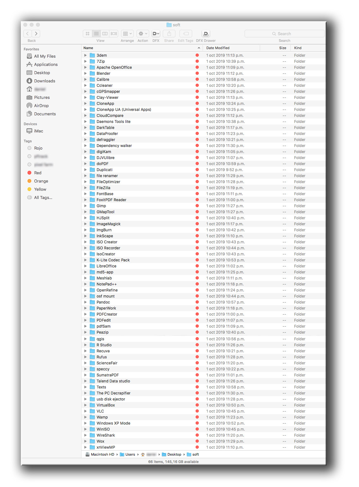
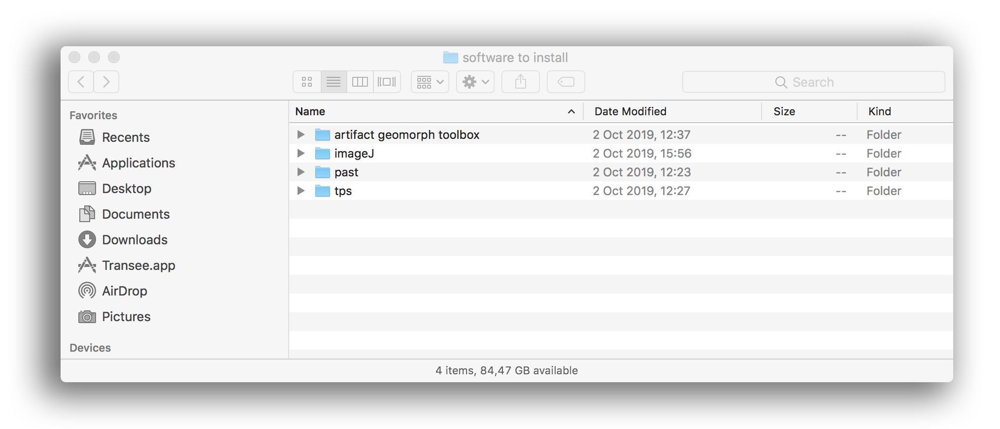

  

---

# JUSTIFICACIÓN / [Rationale](README.md)

* Procedimientos para la primera instalación. Una _lista rápida_ de software que instalar, centrada en proyectos de código abierto, principalmente para el entorno Windows© de Microsoft, MacOSX y Linux. Por cierto, se trata de un repositorio en _constante_ evolución
* Este repositorio es un documento dinámico que crecerá y se adaptará con el tiempo para satisfacer las necesidades, los presupuestos, la potencia de la CPU, los proyectos internos, etc.

### ¿Para qué sirve este repositorio? ###

* Resumen rápido
    - Una lista rápida de software para instalar en una CPU nueva, centrada en herramientas de software de código abierto
    - Versión 1.01

### ¿Cómo lo configuro? ###

* Resumen de la configuración
    - Consulte nuestra lista de herramientas (en su mayoría) de código abierto, clasificadas por:

        | sistema operativo |  
        |:--|
        | [Microsoft Windows®](pc_software_to_install.md) |
		| [MacOSX®](mac_software_to_install.md) |
        | [Linux®](linux_software_to_install.md) |  

* Configuración
    - No existe una situación en la que "esta regla se aplique a todos", ya que hay _algunas_ interdependencias entre las partes, por ejemplo: [Dstretch](dstretch/dstretch_(internal_use).md) necesita [ImageJ](https://imagej.nih.gov/ij/index.html) y, a su vez, [ImageJ](https://imagej.nih.gov/ij/index.html) necesita [Java](https://www.java.com/es/download/). Por cierto, el ejemplo anterior es -dadas las circunstancias- una situación "_rara avis_".
* Dependencias
    - Algunos de los programas implicados (principalmente [R](https://www.r-project.org/), [ImageJ](https://imagej.nih.gov/ij/index.html) y [Node.js](https://nodejs.org/) ) tienden a comprobar las interdependencias de forma predeterminada 
 
* Configuración de la base de datos
    - Nuestra base de datos, que al principio es mínima, evolucionará en función de los problemas y necesidades del sistema operativo. La misma evolución de los paradigmas tecnológicos dará lugar a cambios profundos a lo largo del tiempo
* Cómo ejecutar pruebas
    - No existe un método `run-to-test` que se pueda aplicar, al menos, hasta ahora
* Instrucciones de implementación
    - Todo software implica propiedades/métodos de `instalación-desinstalación`

### Incidencias ###

* Consúltelas [aquí](https://github.com/imhicihu/Software-installations/issues)
     
### ¿Con quién debo hablar? ###

* Propietario o administrador del repositorio
    - Ponte en contacto con `imhicihu` en `gmail` punto `com`

### Código de conducta

* Por favor, consulta nuestro [Código de conducta](codigo_de_conducta.md)

### Aspectos legales ###

* Todas las marcas comerciales son propiedad de sus respectivos propietarios

### Licencia ###

* El contenido de este proyecto está bajo una 
