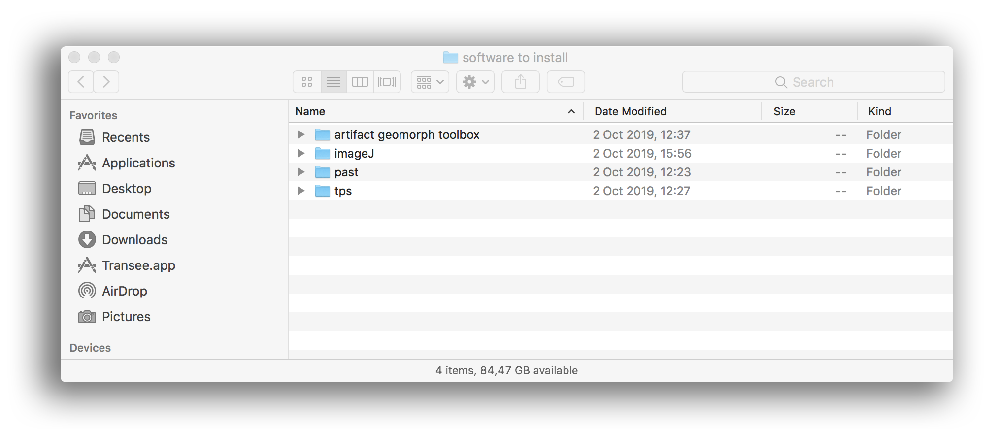

# RATIONALE #

* First time installation procedures. A _quick-list_ of software to install with a focus on open-source projects mostly for the Microsoft Windows© realm. By the way, a repo in _perpetual_ progress
* This repo is a living document that will grow and adapt over time according to meet needs, budgets, CPU's power, internal projects, etc.

### What is this repository for? ###

* Quick summary
    - A quick-list of software to install in a brand new CPU, with a focus on open-source software solution tools
* Version 1.01

### How do I get set up? ###

* Summary of set up
    - Check our list of (mostly) open-source tools, discriminated by:

		| operating system |  
		|:--|
		| [Microsoft Windows®](pc_software_to_install.md) |
		| [MacOSX®](mac_software_to_install.md) |
		| [Linux®](linux_software_to_install.md) |  

* Configuration
    - There is no `this law applies to all` situation, since there is _some_ interdependencies between parties, ie: [Dstretch](dstretch/dstretch_(internal_use).md) needs [ImageJ](https://imagej.nih.gov/ij/index.html) and itself [ImageJ](https://imagej.nih.gov/ij/index.html) needs [Java](https://www.java.com/es/download/). By the way, the former example is a `rara avis` situation.
* Dependencies
    - Some software involved (mostly [R](https://www.r-project.org/), [ImageJ](https://imagej.nih.gov/ij/index.html) and [Node.js](https://nodejs.org/) ) are prone to check inter-dependencies by default 
 
* Database configuration
    - Our database since minimal -at first- will evolve according operating system issues and needs. The same evolution of technology paradigms will result in deeply changes across time
* How to run tests
    - There is no `run-to-test` method to apply, at least, up to now
* Deployment instructions
    - Every software involves `install-uninstall` properties/method

### Issues ###

* Check them on [here](https://github.com/imhicihu/Software-installations/issues)
     
### Who do I talk to? ###

* Repo owner or admin
    - Contact `imhicihu` at `gmail` dot `com`

### Code of Conduct

* Please, check our [Code of Conduct](code_of_conduct.md)

### Legal ###

* All trademarks are the property of their respective owners

### License ###

* The content of this project itself is licensed under the 
